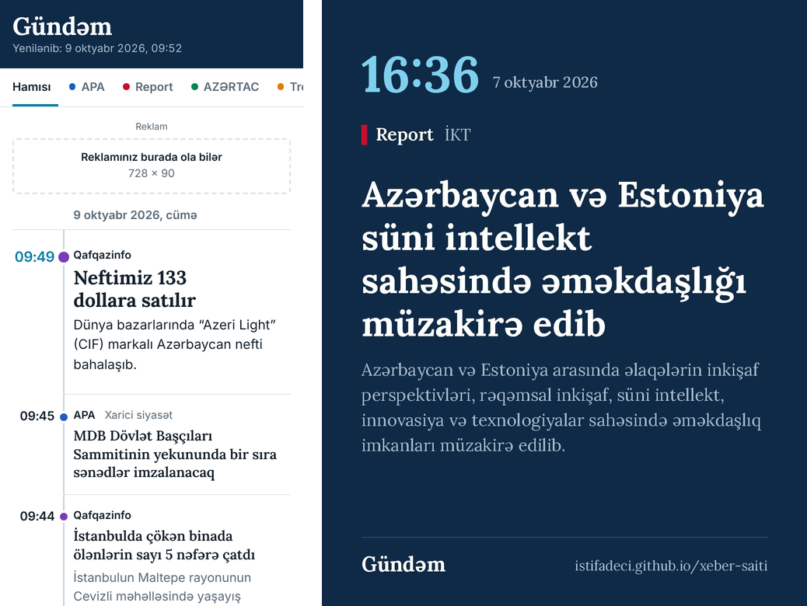
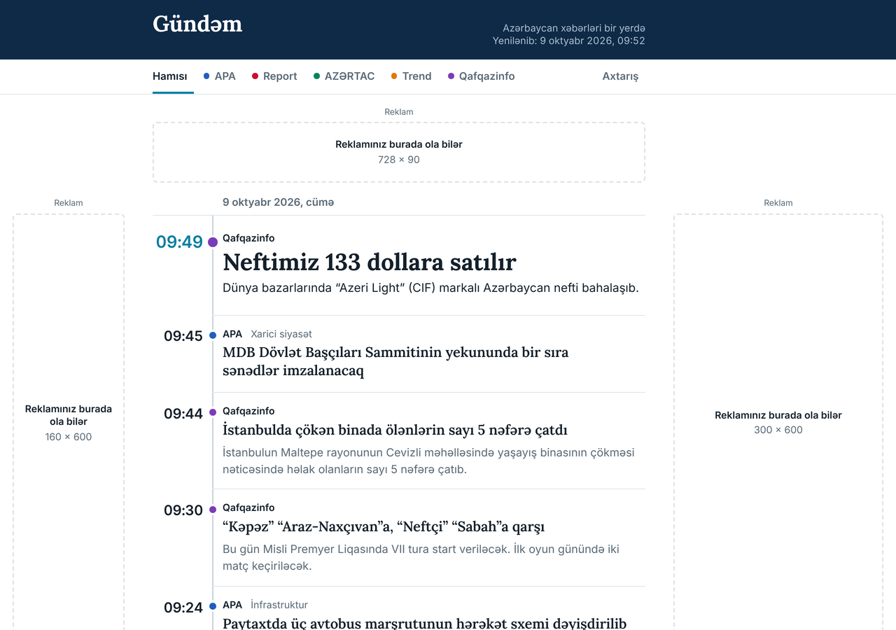

# Gündəm — avtomatik xəbər saytı və paylaşım botu

Bot hər 30 dəqiqədən bir icazə verən Azərbaycan xəbər saytlarının (APA, AZƏRTAC, Report) RSS lentlərini oxuyur və:

- **sayta** hər xəbər üçün ayrıca səhifə əlavə edir (başlıq, qısa təsvir, mənbəyə link);
- **Telegram kanalına** hər dəfə ən təzə 4 xəbəri göndərir;
- **Facebook səhifəsində** saatda 1 xəbər paylaşır;
- **Instagram-da** iki saatda 1 xəbəri avtomatik hazırlanmış şəkil-kartla paylaşır;
- **Threads-də** saatda 1 xəbər paylaşır.

Saytda **reklam yerləri** də var: yuxarıda banner, geniş ekranda sağ və sol sütunlar, telefonda xəbərlərin arasında bir blok.

Hər şey GitHub-ın pulsuz xidmətlərində işləyir: server almağa, kompüteri açıq saxlamağa ehtiyac yoxdur.



---

## Quraşdırma

Quraşdırma bir dəfəlikdir və təxminən 1 saat çəkir. Ən rahatı kompüterdən etməkdir. Hər addımda istifadə etmədiyiniz şəbəkəni ötürə bilərsiniz — bot yalnız açarı əlavə olunmuş şəbəkələrdə paylaşır.

### 1. GitHub-da layihəni yaradın

1. [github.com](https://github.com)-da pulsuz hesab açın.
2. Sağ yuxarıda **+** → **New repository**. Ad: `xeber-saiti`. **Public** seçin (Pages və Actions pulsuz və limitsiz olsun deyə). **Create repository**.
3. **Zip faylını yükləyin.** Açılan səhifədə **uploading an existing file** linkinə basın, `xeber-saiti.zip` faylını seçin (açmadan, olduğu kimi) və **Commit changes** basın.
4. **Botun iş faylını yaradın.** **Add file → Create new file**. Ad sahəsinə dəqiq bunu yazın: `.github/workflows/xeber-botu.yml`. Mətn sahəsinə arxivdəki eyni adlı faylın məzmununu yapışdırın və **Commit changes** basın.
   Bunu əl ilə etmək lazımdır, çünki GitHub təhlükəsizlik səbəbindən botun öz iş faylını yaratmasına icazə vermir.
5. **Settings → Pages → Build and deployment → Source**: **GitHub Actions** seçin.
6. **Actions** bölməsinə keçin. "Workflows aren't being run…" yazısı çıxsa, **I understand my workflows, go ahead and enable them** basın.

4-cü addımdan sonra bot ilk dəfə işə düşür, zip faylını özü açır və bütün faylları layihəyə yerləşdirir. Bu, 2–3 dəqiqə çəkir. Açarlar hələ əlavə olunmayıbsa, bot sadəcə saytı qurur.

Kompüterdəsinizsə, zip əvəzinə arxivi açıb `xeber-saiti` qovluğunun içindəkiləri birbaşa sürükləyib yükləyə də bilərsiniz. Bu halda `.github` gizli qovluğunun da yükləndiyini yoxlayın.

Gizli açarları (tokenləri) aşağıdakı addımlarda bu yolla əlavə edəcəksiniz:
**Settings → Secrets and variables → Actions → New repository secret** → ad və dəyər → **Add secret**.

### 2. Telegram

1. Telegram-da [@BotFather](https://t.me/BotFather)-ə `/newbot` yazın, botun adını və istifadəçi adını verin. Sizə `123456789:AA...` kimi token verəcək.
2. İctimai kanal yaradın (məs. `@gundem_xeber`). Kanalın parametrləri → **Administrators** (Adminlər) → **Add Admin** → botunuzu tapın → **Post Messages** (mesaj dərc etmək) icazəsini açıq saxlayın.
3. GitHub-da iki açar əlavə edin:

| Ad | Dəyər |
|---|---|
| `TELEGRAM_BOT_TOKEN` | BotFather-in verdiyi token |
| `TELEGRAM_CHANNEL` | kanalın adı, `@` ilə: `@gundem_xeber` (gizli kanal üçün `-100…` ilə başlayan ID) |

4. *(İstəyə görə, tövsiyə olunur)* Bir şey səhv gedəndə botun sizə şəxsi xəbərdarlıq yazması üçün: öz botunuza şəxsi çatda `/start` yazın, [@userinfobot](https://t.me/userinfobot)-dan öz ID-nizi öyrənin və onu `TELEGRAM_ADMIN_CHAT` adı ilə əlavə edin.

### 3. Facebook səhifəsi və Instagram

Bunlar bir token ilə işləyir. Əvvəlcədən:
- Facebook-da **səhifəniz** (Page) olmalı və siz onun admini olmalısınız.
- Instagram hesabınız **peşəkar** (Biznes və ya Kreator) olmalı və həmin Facebook səhifəsinə bağlanmalıdır: Instagram → Parametrlər → *Hesab növü və alətlər* → *Peşəkar hesaba keçin*; sonra Facebook səhifəsinin parametrlərində *Bağlı hesablar* → Instagram.

**a) Meta tətbiqi yaradın.** [developers.facebook.com/apps](https://developers.facebook.com/apps) → **Create App**. İstifadə ssenarisi (use case) olaraq Facebook səhifəsini idarə etməyi və Instagram-da məzmun dərc etməyi seçin. Tətbiq **Development** rejimində qala bilər: siz tətbiqin admini olduğunuz üçün öz səhifənizə yazmaq üçün Meta yoxlaması (App Review) lazım deyil.

**b) Token alın.** [Graph API Explorer](https://developers.facebook.com/tools/explorer)-də sağda öz tətbiqinizi seçin, **Get User Access Token** basın və bu icazələri işarələyin:
`pages_show_list`, `pages_read_engagement`, `pages_manage_posts`, `instagram_basic`, `instagram_content_publish`, `business_management`.
**Generate Access Token** → açılan pəncərədə səhifənizi və Instagram hesabınızı seçib təsdiqləyin.

**c) Tokeni uzadın.** [Access Token Debugger](https://developers.facebook.com/tools/debug/accesstoken)-ə tokeni yapışdırın → **Debug** → aşağıda **Extend Access Token** → verilən uzun tokeni kopyalayın.

**d) Səhifə tokenini götürün.** Graph API Explorer-də token sahəsinə bu uzun tokeni yapışdırın, sorğu sətrinə `me/accounts` yazıb **Submit** basın. Cavabda səhifənizin altındakı `"access_token"` dəyərini kopyalayın. **Bu səhifə tokeninin müddəti bitmir.**

**e)** GitHub-da `FACEBOOK_PAGE_TOKEN` adı ilə əlavə edin.

### 4. Threads

1. Eyni Meta tətbiqinə (və ya yenisinə) **Access the Threads API** istifadə ssenarisini əlavə edin, `threads_basic` və `threads_content_publish` icazələrini aktivləşdirin. Bu ssenarinin **Settings** bölməsində **Threads App Secret**-i görəcəksiniz — onu kopyalayın.
2. **App roles → Roles → Add People → Threads Tester** → Threads istifadəçi adınızı yazın.
3. Threads-də: **Parametrlər → Hesab → Vebsayt icazələri → Dəvətlər** → dəvəti qəbul edin.
4. [Graph API Explorer](https://developers.facebook.com/tools/explorer)-də yuxarı solda `graph.facebook.com` əvəzinə **threads.net** seçin, tətbiqinizi seçin və **Generate Threads Access Token** basın.
5. GitHub-da iki açar əlavə edin: `THREADS_TOKEN` (bu token) və `THREADS_APP_SECRET` (1-ci addımdakı sirr).
6. **Bir saat ərzində** botu əl ilə işə salın (aşağıda 7-ci addım). Explorer-in verdiyi token adətən 1 saatlıqdır; bot onu 60 günlük tokenə çevirir, şifrələyib saxlayır və hər həftə özü uzadır. Bir daha token əlavə etməyə ehtiyac qalmır.

### 5. Süni intellekt xülasəsi *(istəyə görə)*

Açar olmasa, bot mənbənin öz qısa təsvirini götürür. Açar olsa, sosial şəbəkəyə gedən xəbərlər üçün Claude 2–3 cümləlik xülasəni öz sözləri ilə yazır.

[console.anthropic.com](https://console.anthropic.com) → **API Keys** → açar yaradın və `ANTHROPIC_API_KEY` adı ilə əlavə edin. Xərcə nəzarət üçün Console-da aylıq xərc limiti qoyun.

### 6. Yoxlayın

**Actions → Xəbər botu → Run workflow** → **Yalnız açarları yoxla** qutusunu işarələyin → yaşıl **Run workflow** düyməsi. Bir dəqiqə sonra işə klikləyib **Yoxla** addımını açın:

```
✅ APA: lentdə 50 xəbər
✅ Telegram: @gundem_bot kanala yaza bilir
✅ Facebook: “Gündəm” səhifəsinə yazmağa hazırdır
✅ Instagram: @gundem hesabına yazmağa hazırdır
✅ Threads: @gundem hesabına yazmağa hazırdır (token hər həftə avtomatik uzadılacaq)
```

❌ olan sətir nəyin səhv olduğunu yazır. Düzəldin və yoxlamanı təkrarlayın.

### 7. İşə salın

**Actions → Xəbər botu → Run workflow**. 3–5 dəqiqə sonra:
- sayt `https://İSTİFADƏÇİ-ADINIZ.github.io/xeber-saiti/` ünvanında açılacaq;
- Telegram kanalına ilk xəbərlər düşəcək;
- Facebook, Instagram və Threads-də ilk post görünəcək.

Bundan sonra bot hər 30 dəqiqədən bir özü işləyir.

---

## Ayarlar

Bütün ayarlar `config.toml` faylındadır. GitHub-da faylı açıb qələm işarəsinə basaraq dəyişin və **Commit changes** edin — bot dərhal yeni ayarlarla işə düşəcək.

| Nə etmək istəyirsiniz | Nəyi dəyişin |
|---|---|
| Saytın adını dəyişmək | `[site]` → `name`, `tagline` |
| Öz domeninizi qoşmaq | **Settings → Pages → Custom domain**, sonra `[site]` → `url` |
| Telegrama daha az/çox xəbər | `[telegram]` → `max_per_run`, `min_interval_minutes` |
| Facebook/Instagram/Threads tezliyi | uyğun bölmədə `max_per_run`, `min_interval_minutes` |
| Bir şəbəkəni söndürmək | uyğun bölmədə `enabled = false` |
| Yalnız müəyyən mövzular paylaşılsın | `[publish]` → `include_keywords = ["futbol", "neft"]` |
| Müəyyən mövzular paylaşılmasın | `[publish]` → `exclude_keywords = [...]` |
| Saytın altında sosial linklər | hər şəbəkə bölməsində `url` |
| Yeni xəbər mənbəyi | faylın sonundakı `[[sources]]` blokunu kopyalayıb RSS ünvanını yazın |
| Mənbə saytda qalsın, amma paylaşılmasın | həmin mənbəyə `social = false` |
| Mənbəni söndürmək | həmin mənbəyə `enabled = false` |
| Mənbə adlarını göstərmək/gizlətmək | `[site]` → `show_sources = true / false` |
| Şəkillərin növü | `[images]` → `mode` (aşağıda "Şəkillər") |
| Reklam əlavə etmək | aşağıdakı "Reklam yerləri" bölməsinə baxın |

---

## Mənbələr və şəkillər

**Mənbə adları.** `show_sources = false` olduqda mənbə saytların adları saytda, menyuda və paylaşımlarda görünmür. Menyuda bölmələr olur: Siyasət, İqtisadiyyat, Cəmiyyət, Dünya, İdman, Hadisə. Hər xəbərin öz səhifəsində yalnız kiçik "Mənbə: apa.az" keçidi qalır. APA, AZƏRTAC və Report materiallardan istifadəni məhz mənbəyə keçid qoymaq şərti ilə icazə verir.

**Söndürülmüş mənbələr.** Trend reklamlı saytlarda istifadəni qadağan edir və gündə ən çox 10 xəbərə icazə verir. Qafqazinfo isə istifadə qaydası yazmayıb. Ona görə hər ikisi söndürülüb. İcazə alsanız, `config.toml`-da `enabled = true` edin.

**Şəkillər.** Başqa saytların fotoları götürülmür: heç bir mənbə fotolardan istifadəyə icazə vermir, mövzuya görə seçilən stok fotolar isə çox vaxt xəbərə uyğun gəlmir. Bunun əvəzinə bot hər xəbər üçün öz kartını çəkir: bölmənin rəngi, bölmənin adı, xəbərin başlığı və tarixi. Kart başlığın özündən yarandığı üçün həmişə xəbərə uyğundur.

Bu kart xəbər səhifəsində görünür və link Telegram, Facebook, WhatsApp-da paylaşılanda önizləmə şəkli olur. Siyahıda isə hər xəbərin yanında bölmənin nişanı var (bina, qrafik, insanlar, qlobus, kubok, xəbərdarlıq işarəsi).

`config.toml`-da `[images]` → `mode = "cover"` yazsanız saytda yalnız bölmə nişanları, `mode = "off"` yazsanız şəkilsiz olur. Paylaşım önizləməsi hər halda kart olaraq qalır.

Əvvəllər paylaşılmış linklərin köhnə önizləməsini Telegram və Facebook yadda saxlayır. Telegram-da yeniləmək üçün @WebpageBot-a həmin linki göndərin. Facebook-da bunu "Sharing Debugger" səhifəsində "Scrape Again" ilə edin.

---

## Reklam yerləri



| Yer | Harada görünür | Ölçü |
|---|---|---|
| `top` | yuxarıda, menyunun altında — bütün ekranlarda | 728 × 90 |
| `left` | solda, xəbərlərin yanında — geniş ekranlarda (1280 piksel və daha geniş) | 160 × 600 |
| `right` | sağda, xəbərlərin yanında — geniş ekranlarda | 300 × 600 |
| `lent` | telefon və planşetdə 6-cı xəbərdən sonra, həm də xəbər səhifəsində | 300 × 250 |

Reklam olmayanda yerlərdə "Reklamınız burada ola bilər" qutusu görünür. `[ads]` bölməsində `contact_url`-a Telegram və ya e-poçt linkinizi yazsanız, reklamverən bu qutuya basıb sizinlə əlaqə saxlaya bilər. Qutuları gizlətmək üçün `placeholder = false` yazın.

**Öz banneriniz (birbaşa satılan reklam):**
1. Şəkli GitHub-da `static/reklam/` qovluğuna yükləyin (**Add file → Upload files**).
2. `config.toml`-da uyğun yerin `banners` siyahısına əlavə edin:

```toml
[ads.top]
banners = [
  { image = "static/reklam/ust.jpg", link = "https://reklamveren.az", alt = "Şirkətin adı" },
]
```

Bir yerə bir neçə banner yazsanız, hər səhifə açılışında təsadüfi biri göstərilir.

**Reklam şəbəkəsi (Google AdSense və s.):** şəbəkənin verdiyi ümumi `<script>` kodunu `[ads]` → `head_html`-a, hər reklam bloku kodunu isə uyğun yerin `html = """ ... """` sahəsinə yapışdırın. `ads.txt` tələb olunarsa, mətnini `ads_txt`-ə yazın. AdSense adətən saytın öz domenində olmasını tələb edir, ona görə əvvəlcə domen alıb qoşmağınız lazım gələ bilər.

Bir yeri tamamilə söndürmək üçün həmin bölməyə `enabled = false` yazın; bütün reklamları söndürmək üçün `[ads]` → `enabled = false`.

---

## Necə işləyir

Hər 30 dəqiqədə GitHub Actions üç addım işlədir:

1. **Topla** — lentləri oxuyur, yeni xəbərləri ayırır, eyni xəbərin başqa saytdakı təkrarını atır, qısa təsvir hazırlayır, hansı xəbərin harada paylaşılacağını seçir (müxtəlif mənbələrdən ən təzələri) və saytı qurur.
2. **Yayımla** — saytı GitHub Pages-ə yerləşdirir.
3. **Paylaş** — seçilmiş xəbərləri Telegram, Facebook, Instagram və Threads-ə göndərir. Bu addım saytdan sonra gəlir ki, paylaşımdakı linklər və Instagram şəkli artıq açılsın.

Botun yaddaşı (hansı xəbəri görüb, hansını paylaşıb) `bot-data` adlı ayrıca budaqda saxlanılır və hər dəfə üzərinə yazılır, ona görə layihə zamanla böyümür. Threads tokeni orada şifrəli saxlanılır; açarı yalnız sizin GitHub Secrets-dədir.

---

## Problemlər

**Sayt açılmır.** Settings → Pages-də Source **GitHub Actions** olmalıdır. Actions-da son işin qırmızı olub-olmadığına baxın.

**Telegrama heç nə gəlmir.** Açarları yoxlayın (6-cı addım). Ən çox rast gəlinən səbəb: bot kanalda admin deyil və ya kanal adı `@` olmadan yazılıb.

**Instagram: "şəkil saytda açılmadı".** Sayt hələ yayımlanmayıb (Pages addımına baxın). Bot növbəti dəfə yenidən cəhd edəcək.

**Instagram: "biznes hesabı bağlanmayıb".** Instagram hesabı peşəkar olmalı və Facebook səhifəsinə bağlanmalıdır, tokeni alarkən Instagram hesabını da seçməlisiniz.

**Facebook: "permission" xətası.** Token **səhifə** tokeni olmalıdır (3-cü addım, d bəndi) və bütün icazələr verilməlidir.

**Threads: "token qəbul olunmadı".** Qısamüddətli tokenin 1 saatı keçib. Yenisini yaradın, `THREADS_TOKEN`-i yeniləyin və botu dərhal əl ilə işə salın.

**Bot birdən dayandı.** GitHub uzun müddət aktivlik olmayan layihələrdə planlı işləri dayandıra bilər. Actions → Xəbər botu → **Enable workflow**.

**Botu müvəqqəti dayandırmaq.** Actions → Xəbər botu → sağdakı **…** → **Disable workflow**.

---

## Müəllif hüquqları

Bot xəbərlərin tam mətnini və şəkillərini köçürmür: saytda və paylaşımlarda yalnız başlıq, qısa təsvir və mənbəyə link olur. Instagram kartları da yalnız başlıqdan hazırlanır. Hər hansı mənbə öz xəbərlərinin götürülməsinə etiraz etsə, `config.toml`-da həmin mənbəyə `enabled = false` yazın.

---

## Fayllar

```
config.toml              ayarlar
bot/run.py               əsas axın: topla → sayt → paylaş
bot/sources.py           RSS oxuyucu
bot/summarize.py         qısa təsvir və süni intellekt xülasəsi
bot/publish.py           nəyin harada paylaşılacağını seçmək və paylaşmaq
bot/telegram.py          Telegram
bot/social.py            Facebook, Instagram, Threads (Meta API)
bot/tokens.py            Threads tokeninin avtomatik uzadılması
bot/cards.py             xəbər kartları, bölmə nişanları, Instagram kartları
bot/build.py             statik sayt
bot/check.py             açarların yoxlanması
templates/, static/      saytın dizaynı (static/reklam/ — bannerlər üçün)
scripts/data.sh          botun yaddaşını saxlamaq/bərpa etmək
.github/workflows/       avtomatik işlər
```

Öz kompüterinizdə sınamaq üçün (Python 3.11+):

```bash
pip install -r requirements.txt
python -m bot.run collect      # xəbərləri topla, _site/ qovluğunda saytı qur
python -m bot.check            # açarları yoxla
```

Lora şrifti SIL Open Font License 1.1 ilə yayılır (`bot/fonts/OFL.txt`).
